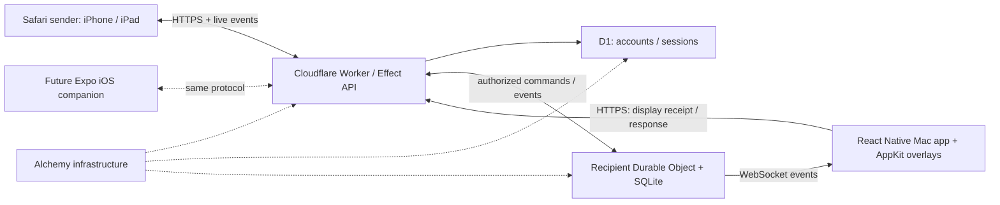

# Shouldertap architecture

September 30, 2026. Architecture planning only; application scaffolding, Git initialization, device verification, and deployment have not happened. The [Notion concept document](https://www.notion.so/3eb7155b453881c7bc4cdc8ef57d87e2) remains the product source of truth. This document records the technical direction discussed with Jake.

## Agreed scope and preferences

- Apple devices first. Initial receiver: native Mac menu-bar app. Initial sender: Safari on iPhone/iPad.
- A native iPhone/iPad companion is part of the future plan.
- React Native macOS with a small Apple-specific module is the selected desktop direction. Prioritize native UI and broad TypeScript/Effect reuse.
- TypeScript for application logic, contracts, web/native interfaces, backend, and infrastructure. Swift/AppKit and any required bridge glue cover Mac OS integration.
- Use Alchemy, Cloudflare, and Effect extensively. Use Better T Stack for the foundation and Ultracite for TypeScript formatting/linting.

## Proposed stack

| Layer | Choice | Responsibility |
| --- | --- | --- |
| Workspace | Bun workspaces + Turborepo | Dependency management and coordinated build/check tasks |
| Starting scaffold | Better T Stack | Web, Workers, auth/database packages, Alchemy, Ultracite conventions |
| Mac app | React Native macOS + AppKit module | Menu-bar receiver, one interactive overlay per display, response input |
| Web sender | React + Vite + TanStack Router | Pairing, message composer, connection and response status |
| Future mobile app | Expo + React Native, iOS/iPadOS first | Native sender, response history, notifications, later native integrations |
| API | Cloudflare Worker + Effect | Request validation, authentication adapters, typed errors and application programs |
| Realtime and message state | SQLite-backed Durable Object per recipient | Message acceptance, device receipts, acknowledgements, socket fan-out, recovery |
| Account metadata | D1 + Drizzle + Better Auth | Accounts/sessions and identity-related metadata |
| Infrastructure | Alchemy v2 | Workers, assets, D1, Durable Object namespace/bindings and environments |
| TypeScript quality | Ultracite + Biome | Formatting/linting, separate TypeScript type checks |

These are proposed implementation choices beneath the agreed direction. The cited [backend research](research/backend-stack.md) and [Apple client research](research/apple-clients.md) record current support and compatibility gates. Better T Stack supplies a foundation, not every application abstraction: its stock API layer should give way to Effect's HTTP facilities where feasible.

React/Vite suits a small authenticated sender with little server-rendering need. A later public marketing site can be a separate choice. Expo handles the future mobile client; the Mac client has its own React Native macOS/Xcode project.

## Runtime topology



The API authorizes connection upgrades and routes them to the recipient object. The WebSocket is then owned by the Durable Object. Commands and acknowledgements use HTTPS; sockets carry server events. Clients are never allowed to choose an arbitrary recipient and bypass access checks. A Safari sender subscribes only to authorized message status/response events, with a bounded session lifetime and explicit revocation. Reconnect fetches durable state if an event was missed.

The web asset build can be attached to the API Worker for one origin and one deployment. Cloudflare [Workers Static Assets](https://developers.cloudflare.com/workers/static-assets/) supports this model. Route API, auth, and WebSocket paths through Worker code before the SPA fallback. If the generated scaffold initially splits web and API Workers, adapt the deployment deliberately and verify cookie/upgrade routing.

## Own message state in one place

The recipient Durable Object is the authoritative inbox. Persist a message before accepting a send, keep per-device presentation receipts, and persist a response before reporting acknowledgement to the sender. D1 does not also own the same message state.

Use three distinct facts in the product:

1. **Accepted:** the server stored the message.
2. **Displayed:** a connected Mac reports that it presented the overlay.
3. **Acknowledged:** the recipient explicitly responded.

A socket write alone does not establish that a person saw a message. One Mac's valid response acknowledges the recipient's message and broadcasts dismissal to every connected Mac. A second response or retry must not overwrite the first committed result accidentally. Define an explicit later update operation if responses become editable.

Send commands carry idempotency keys. Events carry IDs/order information; reconnect obtains a durable snapshot or missed events. Sleep/wake and disconnection do not imply acknowledgement. A Mac can close its local overlay promptly on response while showing sync status if the acknowledgement cannot yet reach the server; the sender sees confirmed acknowledgement only after server persistence. The offline acknowledgement must be retained locally and retried.

Cloudflare [Durable Object WebSockets](https://developers.cloudflare.com/durable-objects/best-practices/websockets/) supports hibernating socket ownership. Run bounded Effect programs at request, socket-event, and alarm boundaries. Do not rely on an indefinitely running Effect fiber, in-memory subscription, or timer surviving hibernation.

Accounts/sessions belong in D1. Sender grants, registered receiver devices, pairing consumption, and revocation that govern the inbox should have one authoritative owner in its Durable Object. Define the identity-to-object mapping in D1 without duplicating active permission truth. Disconnect revoked devices/subscribers and recheck authorization when processing commands.

## Where Effect belongs

- **Domain/contracts:** schemas for messages, responses, events, and failures; domain policy programs and services.
- **API:** Effect HTTP API/handlers where supported by the selected version, service composition, auth/database adapters, typed faults, timeouts, tracing and cancellation.
- **Mac/web/mobile clients:** decoding, request orchestration, reconnect/retry policies and acknowledgement synchronization. Platform adapters supply sockets, Fetch, secure storage and app lifecycle.
- **Infrastructure:** Alchemy v2's Effect-based resource graph and dependency injection.

Native display/window calls remain native. React rendering remains React. Prefer one small platform interface over wrapping every view operation in Effect. Validate the exact Effect/client/runtime combination before broad adoption.

Expose ordinary HTTPS JSON commands and versioned JSON WebSocket events. Schema-derived clients are useful, but the protocol should remain usable independently of an Effect-specific RPC runtime. That preserves the ability to replace a client or add Apple extensions later.

## Repository shape

```text
apps/
  web/               # Safari sender
  api/               # Worker entry points and recipient Durable Object
  macos/             # React Native macOS + Apple platform module
  mobile/            # later: Expo iPhone/iPad companion
packages/
  domain/            # Effect schemas, typed faults and message policies
  client/            # shared HTTP/events/sync logic; platform adapters
  auth/              # Better Auth configuration and identity adapter
  db/                # D1 account schema and migrations
infra/
  alchemy.run.ts     # declarative Cloudflare resources and environments
docs/
  architecture.md
  research/
```

This is a proposed tree, not a set of empty packages to create now. Add packages when code needs the boundary. Keep UI implementation separate for web and native; extract small React Native UI pieces only once Mac and mobile genuinely share them. Do not share server auth configuration or Node/Bun infrastructure packages with application bundles.

## Versions and generator choices

Current Alchemy docs describe v2 beta with Effect 4 RC. Better T Stack's current Alchemy generator follows that family. A cohesive, exactly pinned v2/Effect 4 combination is the proposed lane for this new project; a lockfile and compatibility checks are required. Do not combine unqualified stable Effect 3 with Alchemy v2, or copy v3 examples into v4 code without checking the API.

Generate a Workers target, SQLite/D1 with Drizzle, Better Auth, a React/TanStack web frontend, Alchemy deployment, Ultracite/Biome, and Turborepo. Biome follows the current Better T Stack Ultracite helper default and keeps one root formatter/linter. Select no stock tRPC/oRPC layer where the generator permits it, and introduce the Effect API after generation. Do not select its Tauri desktop addon or assume its Expo option generates a Mac project.

The current Better T Stack Workers scaffold requires Hono. Keep that wrapper restricted to transport/auth/upgrade boundaries and host Effect HTTP handlers behind it. Application policy belongs in Effect services. Check the generated dependency graph and commit a coherent lockfile before adding feature code.

## Implementation order

1. Initialize Git and the minimal workspace from the selected Better T Stack options. Verify generated Alchemy, Effect, Workers, and database versions agree; add the separate Mac project.
2. Prove the Mac host: menu-bar lifecycle, two-display overlay, full-screen apps/Spaces, hot-plug, input focus, local response dismissal, and sleep/wake. Smoke-test the selected Effect runtime on Mac.
3. Build one complete vertical slice: trusted Safari sender, persisted send, Mac receipt, response, Safari confirmation, and a second Mac dismissing from the same acknowledgement.
4. Add real pairing, revocation, reconnect/offline recovery and history. Exercise authorization and duplicate commands through the real Workers/Durable Objects runtime.
5. Add the native iPhone/iPad companion against the same domain/protocol. Test on a physical device, then add background response notifications and native integrations.

For v0, one Worker, one D1 database, and a recipient Durable Object namespace supply the necessary backend roles. Add alarms for a real snooze/scheduling requirement, storage for attachments when implemented, and push for background companion notifications when implemented. Each infrastructure addition should correspond to a product requirement.

## v0 status (September 30, 2026)

The first vertical slice is built; see the [README](../README.md) for what it does, how to run it, and known gaps. Alchemy is the source of truth: the backend follows Alchemy's documented patterns at `alchemy@2.0.0-beta.79` / `effect@4.0.0-rc.115` (a `Cloudflare.Worker` class serving an Effect `HttpApi`; a modular `Cloudflare.DurableObject` with typed RPC errors, `Drizzle.DurableObject` storage and `Cloudflare.upgrade()` sockets; one root `alchemy.run.ts`; the Alchemy `Test` harness). Remaining departures from this plan: no D1/Better Auth yet (invite-link pairing with bearer credentials owned by the Inbox), and the Mac credential is stored in a file until the app is Developer ID signed.

## Outstanding proof (original)

No installed framework, generated project, desktop overlay, network flow, or deployment was tested during this architecture discussion. The Mac bridge's behavior and the selected prerelease package combination remain implementation gates. The current folder began with only a README and no `.git` directory; research and this plan are the artifacts produced so far.
