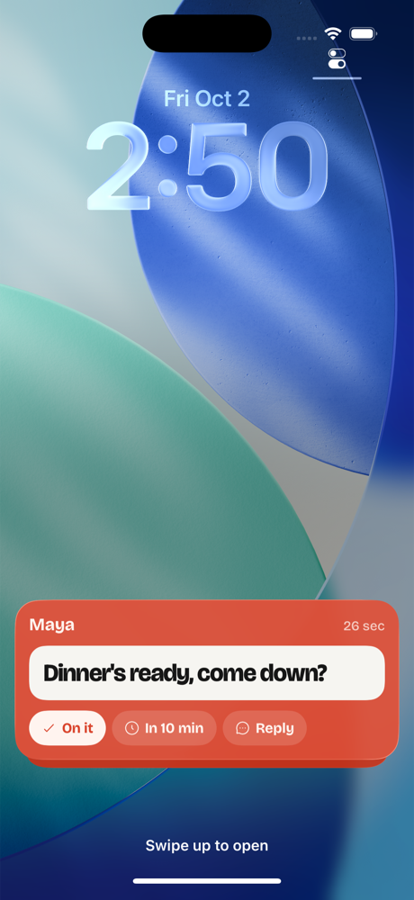
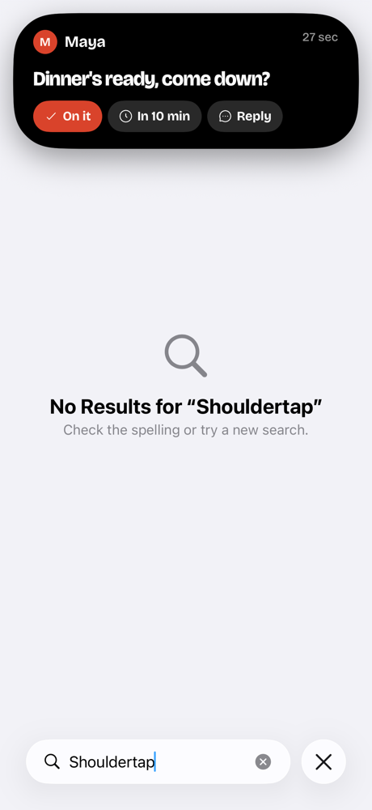
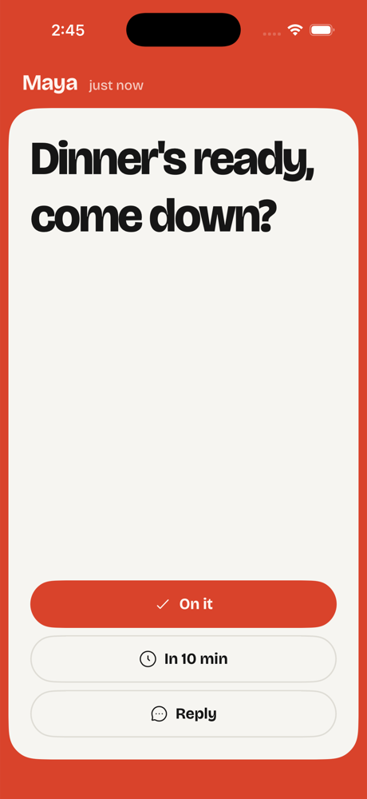
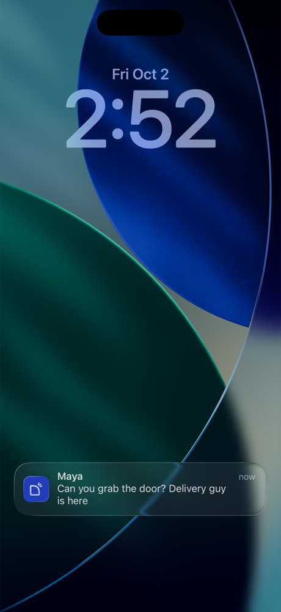

# iPhone as a receiver

Checked October 2, 2026, on Xcode 26.3 with the iOS 26.3 simulator (iPhone 17 Pro). The research is from Apple platform knowledge and wasn't re-verified against live documentation. The prototype was built and exercised in the simulator; no device testing has been done.

## Question

On the Mac, a tap takes over every display: a borderless `.screenSaver`-level window in the sender's color (`apps/macos/Sources/Shouldertap/Overlay.swift`). Can the iPhone do the same, so a tap reaches the recipient on every device they own, not only their Mac?

## Answer

Not literally. iOS gives no third-party app a way to draw over other apps, the Home Screen or the Lock Screen, and no entitlement changes that. The app owns the screen only while it's in the foreground.

The closest equivalent is three layers, used by what the phone is doing when the tap lands:

| Phone state | Surface | What it does |
| --- | --- | --- |
| Locked | Live Activity, Lock Screen | Wakes the screen; a card in the sender's color stays pinned until answered. On it and In 10 min run without unlocking. |
| Unlocked, another app open | Live Activity, Dynamic Island | Expands over the current app on arrival, then shrinks to a compact pill (initial and name). Long-press expands it again with the same buttons. iPhone 14 Pro and later; other models only get the Lock Screen and a banner. |
| Shouldertap open | In-app takeover | The Mac overlay on a phone: full-screen frame color, paper page, On it / In 10 min / Reply. |
| Live Activities turned off | Time Sensitive notification | Breaks through Focus, with On it, In 10 min and a typed Reply as notification actions. |

### Options considered and rejected

- **Critical Alerts**: these bypass mute and Do Not Disturb, but need an entitlement Apple grants only to health, safety and security apps. Shouldertap wouldn't qualify.
- **CallKit / PushKit (a fake incoming call)**: this is the only real full-screen interrupt available to third parties. App Review rejects it for anything but VoIP, and iOS terminates apps that receive a VoIP push without reporting a call.
- **AlarmKit (iOS 26)**: full-screen alarms that break through silent mode. They're intended for alarms and timers, so using them for messages will very likely fail review. They're also scheduled on the device, not triggered by a push. This is the least certain conclusion here; re-check the current AlarmKit docs and review guidelines before ruling it out for good.

### Platform constraints that shape the design

- A Live Activity can only be **started by the app while it's in the foreground**, or **by a push-to-start APNs push** (iOS 17.2+). The production path is push-to-start from the server, and the app's deployment target is iOS 17.0, so this needs an availability check.
- An update sent with an `AlertConfiguration` (or an APNs `alert` on a Live Activity push) lights the Lock Screen or expands the Dynamic Island. That is the "arrival" moment.
- Live Activity buttons run `LiveActivityIntent`s in the app's process without opening it (iOS 17+). A Live Activity **cannot take text input**, so Reply opens the app.
- iOS shows a one-time "Allow Live Activities from Shouldertap?" prompt the first time the user interacts with one. "Don't Allow" ends all of the app's activities and turns the feature off until changed in Settings.
- The user can turn off Live Activities per app, so the notification has to stand on its own.

## Prototype (uncommitted, in this worktree)

The prototype covers only the receiving surfaces. The iPhone app is still a sender only: there's no inbox for the phone, answers aren't sent to the server, and there's no APNs. Debug builds fake an arriving tap with a URL.

### Files

- `apps/ios/TapActivity/TapActivity.swift` — compiled into **both** the app and the widget extension. Contains:
  - `TapActivityAttributes`, with static fields tapId, senderName, senderColor and createdAt, and `ContentState` holding the body plus an optional answer;
  - `AnswerTapIntent`, the `LiveActivityIntent` behind On it and In 10 min;
  - `TapActivities.answer`, which shows the answer and dismisses after 4s;
  - `TapActivities.alert`, which re-announces a tap with an `AlertConfiguration`.
- `apps/ios/Widgets/TapLiveActivity.swift`, plus `Widgets/Info.plist` — the new `ShouldertapWidgets` widget extension. It holds the Lock Screen card and all Dynamic Island presentations: expanded, compact and minimal. It carries its own copies of a small piece of the theme (`Bricolage`, `PersonColor.base/ink`, plus an `accent` that keeps dark swatches legible on the island's black) because `Theme.swift` isn't compiled into the extension. It bundles the Bricolage fonts through `UIAppFonts`.
- `apps/ios/Shouldertap/IncomingTaps.swift` — the app side of receiving:
  - the `IncomingTaps` model, which starts the activity and drives the takeover;
  - `TapTakeover`, the in-app overlay;
  - `NotificationRouter`, the `UNUserNotificationCenterDelegate`. A tap notification that arrives while the app is open becomes the takeover, and its actions answer the tap;
  - URL handling.
- Edits:
  - `App.swift`: the takeover overlay, and routing URLs to `IncomingTaps.handle`.
  - `Push.swift`: registers the notification category at launch.
  - `Info.plist`: `NSSupportsLiveActivities`.
  - `project.pbxproj`: the `ShouldertapWidgets` target, the `TapActivity` synchronized group shared by both targets, and an Embed Foundation Extensions phase. The project file was edited by hand with `B1…` object IDs.

### Running it

Build the `ShouldertapIOS` scheme for an iPhone 17 Pro simulator, then:

```bash
xcrun simctl openurl booted shouldertap://demo-tap/Maya/tomato/6
```

The path is `/<from>/<color>/<delay seconds>`. The query form `?from=&color=&body=&delay=` also works, but some terminals turn `&` into `&amp;`. Without a delay, the tap takes over the open app. With one, the Live Activity starts at once (the app has to be in the foreground) and "arrives" after the delay. Lock the simulator or switch apps before then to see the Lock Screen light up or the island expand.

The notification path takes a payload sent with `xcrun simctl push booted app.shouldertap.ios.debug tap.apns`:

```json
{
  "aps": {
    "alert": { "title": "Maya", "body": "Can you grab the door?" },
    "category": "tap",
    "interruption-level": "time-sensitive",
    "sound": "default"
  },
  "tapId": "demo-push-1",
  "senderName": "Maya",
  "senderColor": "tomato"
}
```

### Verified in the simulator

- In-app takeover in tomato and plum.
- Lock Screen Live Activity, including the woken, full-brightness state.
- Compact Dynamic Island over Settings, and the expanded island appearing by itself on the delayed alert.
- On it from the expanded island ended the activity.
- The push notification arriving on a locked phone.

| Lock Screen | Dynamic Island, expanded | In-app takeover | Notification |
| --- | --- | --- | --- |
|  |  |  |  |

### Not verified

- The notification's long-press actions, and the typed reply from the notification. The simulator wouldn't expand the notification on the Lock Screen.
- The 4-second "You answered: …" state on the Lock Screen.
- Reply from the Live Activity opening the takeover in reply mode.
- Anything on a real device.

### Gotchas hit while building

- With `SWIFT_DEFAULT_ACTOR_ISOLATION = MainActor`:
  - `TapActivityAttributes` must be `nonisolated`, otherwise its `ActivityAttributes` and `Codable` conformances are main-actor-isolated and won't compile.
  - `IncomingTap` is `nonisolated` and `Sendable`, so notification delegate callbacks can build it before hopping to the main actor.
  - `Activity.update` is called from a `nonisolated` static helper, to avoid "sending risks data races" errors.
- When driving the simulator, the panel's screenshots lagged the device, and a tap aimed at "Allow" on the Live Activities prompt landed on "Don't Allow". `xcrun simctl io booted screenshot` is reliable. Reinstalling the app resets the choice.

## What's left to make it real

1. **Server: give the phone an inbox role.** Today the iPhone pairs only as a sender (`SenderStore`) and only the Mac receives. The phone would register as a receiver device on the recipient's Inbox Durable Object (see `docs/architecture.md`). That raises a product question: does a tap go to all of the recipient's devices, and what happens on the others when one device answers?
2. **APNs from the Worker.** This is already sketched in the "PUSH SEAM" comment in `apps/ios/Shouldertap/Push.swift`: the `aps-environment` entitlement, per-pairing device tokens, and an ES256 JWT signed with a `.p8` key, sent over HTTP/2 to `api.push.apple.com`. Live Activities also need:
   - **Push-to-start**: collect `Activity<TapActivityAttributes>.pushToStartTokenUpdates` (iOS 17.2+) and send it to the server. To start an activity, the server sends a push with `apns-push-type: liveactivity` and topic `<bundle id>.push-type.liveactivity`, whose payload includes `attributes-type`, `attributes`, `content-state` and an `alert`.
   - **Per-activity update tokens**: collect `activity.pushTokenUpdates` so the server can end the activity on every device once the tap is answered anywhere (`event: end`).
   - **A fallback**: send the regular Time Sensitive notification when Live Activities are disabled. The server can't tell, so the app should report `ActivityAuthorizationInfo().areActivitiesEnabled`, or the server always sends both. If it sends both, it needs to avoid a double alert.
3. **Send answers to the server.** `TapActivities.answer` and `IncomingTaps.answer` are marked `RECEIVER SEAM`. They should post the `TapResponse` the way the Mac does, using the phone's credential. `AnswerTapIntent` runs in the app process in the background, so it needs the credential from the keychain, not UI state.
4. **Time Sensitive entitlement.** Add `com.apple.developer.usernotifications.time-sensitive`. No approval is needed, but check that `scripts/release-ios.sh` (automatic signing on export) still archives with the new capability.
5. **Notification Content Extension (optional).** Without it, the long-pressed notification is plain iOS. One would give it the frame-color paper look from the mockup.
6. **Takeover polish.** Add a reduced-motion check, Dynamic Type limits for the message size, and a queue ("N more waiting", as on the Mac) when several taps arrive.
7. **iPad.** The app is iPhone-only (`TARGETED_DEVICE_FAMILY = 1`). iPad has Lock Screen Live Activities but no Dynamic Island.
8. **Tests.** The UI tests (`apps/ios/ShouldertapUITests`) could drive the takeover via `shouldertap://demo-tap/...` in debug builds. The takeover has the accessibility identifier `tap-takeover`.
