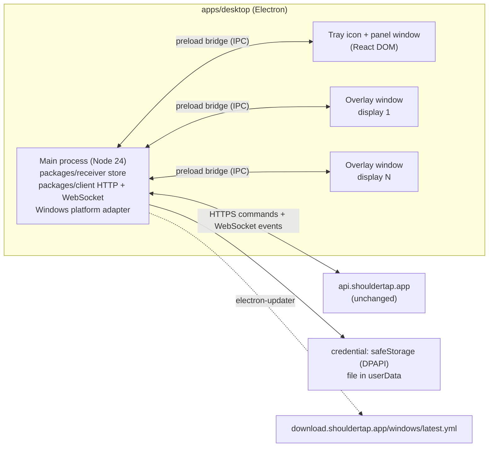

# Windows (and Linux) desktop client research

> Superseded by [windows-client-efficiency.md](windows-client-efficiency.md): Electron was rejected for size and memory in favor of native Rust.

Checked September 30, 2026 against first-party documentation, Electron source, GitHub issues, and npm registry metadata. Research and plan only: no desktop code has been written, no package installed, nothing built, signed or deployed, and no Windows behavior has been observed on hardware. Every claim about how an overlay behaves on Windows is a documented expectation that the first milestone must confirm.

## Scope

The receiver today is the React Native macOS menu-bar app in `apps/macos` (see [Apple client research](apple-clients.md)). This plan adds a Windows receiver with the same promise: when a tap arrives, it covers every display, above full-screen apps, until the recipient answers, and answering on one computer dismisses it on all of them. Linux is best effort. The Cloudflare backend and the wire protocol stay as they are: a Windows computer pairs as another `device` credential, exactly like a second Mac.

## Recommendation

**Build `apps/desktop` in Electron, with the receiver logic shared as TypeScript and the UI written in React DOM.** Keep the Mac app native (React Native macOS + AppKit) for now. Ship Windows first as an NSIS installer served from the existing R2 bucket, updated by `electron-updater` from the same bucket, and signed with Azure Artifact Signing (formerly Trusted Signing) once identity validation clears. Offer Linux as an AppImage with documented limits.

Why Electron wins here:

- **The whole client stays TypeScript.** `packages/client` and `packages/domain` run unchanged in Electron's main process, which is Node 24 (Electron 44.5.1 ships Chromium 152 and Node 24.21, per [releases.electronjs.org](https://releases.electronjs.org/releases.json)). Node has had global `fetch` since 18 and global `WebSocket` by default since 22 ([Node globals](https://nodejs.org/api/globals.html)), and `TextEncoder` is native, so the Hermes polyfill in `apps/macos/src/polyfills.ts` is not needed.
- **Every Windows platform need has a first-party Electron API**: always-on-top windows per display, `screen` display events, `Tray`, `app.setLoginItemSettings`, `safeStorage` (DPAPI), `powerMonitor` resume/unlock, `systemPreferences.getAnimationSettings().prefersReducedMotion`, single-instance lock. The Mac app needed about 700 lines of Swift for the equivalents; the Electron version needs no native code unless focus stealing forces a fallback (see risks).
- **The one hard requirement is decided by Windows, not the framework.** Every option ends up calling `SetWindowPos(HWND_TOPMOST)` and `SetForegroundWindow`, so they inherit the same limits on focus and exclusive-fullscreen games. Given that, the tie-breakers are language reuse, tooling maturity, and Linux, and Electron wins all three.
- **It reaches Linux from the same code**, with the same caveats any toolkit faces on Wayland.

Tradeoffs being accepted:

- **Download size.** The Electron 44.5.1 `win32-x64` runtime zip alone is 158 MB on the [v44.5.1 release](https://github.com/electron/electron/releases/tag/v44.5.1). A compressed NSIS installer will be smaller but should be expected around 100 MB, against 14 MB for today's `Shouldertap-0.1.0.dmg`. Measure it in the first milestone.
- **Memory.** The main process, the tray panel, and one renderer per display while a tap is showing. Overlay windows exist only while a tap is showing.
- **Two UI implementations.** The Mac overlay and popover use React Native primitives; the Windows ones will be DOM. The store, protocol, overlay model, and design tokens are shared; the JSX is not (see "Sharing UI").
- **Chromium security upkeep.** Electron ships a major every 8 weeks and supports the latest three ([timelines](https://www.electronjs.org/docs/latest/tutorial/electron-timelines)), so auto-update is a requirement, not a nicety.

### Alternatives tested

| Option | Overlay/tray/login/secrets on Windows | Reuse | Linux | Verdict |
| --- | --- | --- | --- | --- |
| **Electron** | All first-party APIs. `setAlwaysOnTop(true, "screen-saver")` stays above the taskbar (source below). | Full TS; React DOM; `packages/client` runs in Node main process | Yes, X11 fully; Wayland limited | **Recommended** |
| **Tauri 2** (`tauri` 2.12.1) | `always_on_top` (tao uses `SetWindowPos(HWND_TOPMOST)`), monitors, tray, and the official autostart and updater plugins exist. The updater's static JSON works from a bucket, but signing is mandatory. On focus, tao's `set_focus` does something Electron doesn't do out of the box: when `SetForegroundWindow` fails, it sends a synthetic Alt key and retries ([tao](https://github.com/tauri-apps/tao)). Gaps: **no official keyring plugin**, and Stronghold is informally slated for removal in v3 ([discussion #7846](https://github.com/orgs/tauri-apps/discussions/7846)). `background_throttling` can't be disabled on Windows or Linux, so the socket belongs in Rust. Tray click events are not emitted on Linux. Open overlay issues: [#9439](https://github.com/tauri-apps/tauri/issues/9439) setAlwaysOnTop, [#11176](https://github.com/tauri-apps/tauri/issues/11176) Windows 11 taskbar z-order, [#6843](https://github.com/tauri-apps/tauri/issues/6843) mixed-DPI sizing, [#15947](https://github.com/tauri-apps/tauri/issues/15947) transparent topmost rendering. | TS in a WebView2 renderer. The store and socket would move to Rust, or run in a throttled hidden webview. Secrets and any native fix are Rust. | Yes (WebKitGTK), same Wayland limits | Credible runner-up. Smaller download (WebView2 is preinstalled on Windows 11), but it adds Rust for the store, socket and secrets, plus a second webview engine on Linux. It saves no work on the hard part |
| **React Native for Windows** (0.84.0, tracks RN 0.84.1) | New Architecture is Win32 + Windows App SDK, default since 0.80 ([docs](https://microsoft.github.io/react-native-windows/docs/new-architecture)). Per-monitor topmost windows are possible natively (`OverlappedPresenter.IsAlwaysOnTop`, `DisplayArea.FindAll`), but the multi-window hosting APIs (`ReactNativeAppBuilder`, `ReactNativeIsland`) are marked experimental and there is no official multi-window sample. WinAppSDK has no tray API ([WindowsAppSDK #713](https://github.com/microsoft/WindowsAppSDK/issues/713), open). A Release-build startup crash is open on 0.84.0 ([#16442](https://github.com/microsoft/react-native-windows/issues/16442)). The C++/C# work would be the Windows twin of the 700 Swift lines. | Highest JSX reuse with `apps/macos`, in principle. But the Mac app is on `react-native-macos` 0.83, so the versions differ, and the macOS-only pieces (`PlatformColor`, `enableFocusRing`, native key monitor) do not port. | **None** | Rejected: most native work, experimental hosting, no Linux |
| **react-native-web inside Electron** (0.21.3, React 19 peer) | Same as Electron | Could render the Mac `overlay.tsx` in the DOM. But `ui.tsx` is built on macOS `PlatformColor`, and the popover design is deliberately macOS-native. | Same as Electron | Not for v0. Revisit if the Expo iOS companion makes RN primitives the house UI language |

## What an overlay can and cannot do on Windows

This is the product's gate, so it is stated precisely.

**Z-order.** Windows has one topmost band. Electron's [`SetAlwaysOnTop`](https://github.com/electron/electron/blob/4205b3641daec48af09563d577e17db7dffe44ee/shell/browser/native_window_views.cc#L1189) sets the widget z-order level. On Windows, the levels `floating`, `torn-off-menu`, `modal-panel`, `main-menu` and `status` then deliberately [move the window _behind the taskbar_](https://github.com/electron/electron/blob/4205b3641daec48af09563d577e17db7dffe44ee/shell/browser/native_window_views.cc#L2111). **Use `"screen-saver"`**, the same name as the Mac's `.screenSaver` level, which stays above it. The [BrowserWindow docs](https://www.electronjs.org/docs/latest/api/browser-window) confirm that `level` applies on macOS and Windows. They also say `setVisibleOnAllWorkspaces` "does nothing on Windows", so there is no equivalent of `.canJoinAllSpaces` for Windows virtual desktops. Among topmost windows, the most recently raised wins, so another always-on-top app (Task Manager, PowerToys, a game overlay) can sit above the overlay until it is re-raised with `moveTop()`.

**Borderless and windowed "full-screen" apps** (browsers in F11, video players, most modern games' borderless mode) are ordinary windows composed by DWM. Microsoft's [flip-model guidance](https://learn.microsoft.com/en-us/windows/win32/direct3ddxgi/for-best-performance--use-dxgi-flip-model) says that when other content comes on top, DWM transitions the app back to composed mode or composes the content over it. The overlay should appear above them. This is the Windows analogue of joining a Mac full-screen Space, and it covers the common case.

**Exclusive-fullscreen games** are different. [DXGI best practices](https://learn.microsoft.com/en-us/windows/win32/direct3darticles/dxgi-best-practices) state that in full-screen mode "the Desktop Window Manager (DWM) is disabled". The [DXGI overview](https://learn.microsoft.com/en-us/windows/win32/direct3ddxgi/d3d10-graphics-programming-guide-dxgi) is explicit: a mode-switching swap chain "will relinquish full-screen mode whenever its output window is occluded by another window". A Microsoft answer on [Learn Q&A](https://learn.microsoft.com/en-us/answers/questions/1662445/how-to-show-another-window-on-fse(fullscreen-exclu) confirms that a normal window cannot be shown over exclusive full-screen otherwise. Direct3D 12 has [no exclusive mode at all](https://learn.microsoft.com/en-us/windows/win32/direct3d12/swap-chains); it uses full-screen optimizations, which composite overlays. So the expected outcome is that the overlay does appear, but an older exclusive-fullscreen game drops out of full-screen (a mode switch, like an alt-tab) to show it. Exact per-game behavior needs testing. No framework changes this. The promise should read: "covers full-screen apps; some older games leave full-screen first."

**Focus stealing.** [`SetForegroundWindow`](https://learn.microsoft.com/en-us/windows/win32/api/winuser/nf-winuser-setforegroundwindow) succeeds only if, among other conditions, the caller is the foreground process, received the last input event, or the foreground lock timeout has expired. Otherwise "Windows flashes the taskbar button". A tap arrives while the user is working in another app, which is exactly the case Windows guards against. Electron's `focus()` just calls `widget()->Activate()` ([source](https://github.com/electron/electron/blob/4205b3641daec48af09563d577e17db7dffe44ee/shell/browser/native_window_views.cc#L595)), and reports of `show()`/`focus()` only flashing the taskbar go back years ([#8044](https://github.com/electron/electron/issues/8044), [#2867](https://github.com/electron/electron/issues/2867)). `app.focus({ steal: true })` is macOS-only ([app docs](https://www.electronjs.org/docs/latest/api/app)). Expected behavior: the overlay becomes visible and topmost on every display, but keyboard focus may stay in the app behind it. The 1/2/3 keys and the reply field would then work only after one click on the overlay. Keystrokes typed in that gap go to the app underneath. Plan for click-to-focus as the baseline. Measure how often activation succeeds, and hold a native fallback in reserve (below). Tauri's window layer already does that fallback when `SetForegroundWindow` fails: it sends a synthetic Alt key through `SendInput` and retries. That is evidence the trick is practical, and it is what an Electron helper would replicate.

**Mixed-DPI monitors.** Create each overlay from its `Display.bounds` (in DIPs), then re-apply the bounds after show, and rebuild on `display-added`, `display-removed` and `display-metrics-changed`. Wrong `setSize`/`setPosition` results across mixed scale factors are a long-open Electron bug ([#10862](https://github.com/electron/electron/issues/10862), open since 2017, active August 2026). The spike must include a 100% + 150% pair, and the fallback is `screen.dipToScreenRect` (Windows-only).

**Focus Assist.** Windows turns on Do Not Disturb automatically during games and full-screen apps. That suppresses notifications and, during Focus sessions, taskbar flashing ([Focus](https://support.microsoft.com/en-us/windows/focus-stay-on-task-without-distractions-in-windows-cbcc9ddb-8164-43fa-8919-b9a2af072382)). It does not block windows, so the overlay is unaffected, but the taskbar-flash fallback may be silent.

**Lock screen and UAC.** Nothing can draw on the secure desktop. On `powerMonitor` `unlock-screen` and `resume` ([docs](https://www.electronjs.org/docs/latest/api/power-monitor)), nudge the socket as the Mac does on wake, then re-raise and re-focus the overlays.

**Transparency.** The Mac window is clear and the React view fades in. On Windows, prefer an opaque window painted in the sender's color, faded with `setOpacity()`. Transparent, topmost, full-screen windows are the case that confuses Windows' full-screen ("rude window") heuristics and can leave the taskbar non-topmost afterwards ([RudeWindowFixer analysis](https://github.com/dechamps/RudeWindowFixer), [Tauri #7328](https://github.com/tauri-apps/tauri/issues/7328)).

## Architecture sketch



The process model mirrors the Mac app. There, one Hermes runtime owns the store, and native code mounts the `MenuBar` and `Overlay` roots. In Electron, the **main process owns the store**, because each `BrowserWindow` is its own renderer process and only main outlives them all. Renderers are views: they subscribe to state and send actions, just as the Mac overlay calls `store.respond`.

- `receiver:state` (main → renderer): the `State` snapshot plus, for overlays, `{ tap, screenIndex, reduceMotion }`, the same props `OverlayController.swift` passes today.
- `receiver:*` invokes (renderer → main): `createInbox`, `joinWithCode`, `respond`, `createSenderInvite`, `createDeviceCode`, `revoke`, `setLaunchAtLogin`, `quit`.
- Renderers run with `contextIsolation`, `sandbox`, and no `nodeIntegration`. The preload exposes only that typed surface. The credential never reaches a renderer.
- Keys: the Mac needs an `NSEvent` monitor because RN views don't see 1/2/3. In the DOM, the focused overlay's `keydown` handler does it directly.

Proposed layout:

```text
packages/receiver/          NEW: moved from apps/macos/src, shared by Mac and desktop
  src/store.ts              the current store, taking a ReceiverPlatform instead of importing native.ts
  src/platform.ts           interface: secrets, prefs, deviceName, overlay show/hide, setPending, openPanel, qrCode, onWake
  src/overlay-model.ts      answers list, fitMessage, since (pure; lifted from overlay.tsx)
apps/desktop/               NEW: Electron (Windows first, Linux best effort)
  electron-builder.yml
  vite.config.ts            renderer pages: panel.html, overlay.html
  src/main/{main,platform,overlays,tray,updater,ipc}.ts
  src/preload/index.ts
  src/renderer/{panel,overlay}/…
  build/                    icon.ico, tray frames (light/dark, knock animation)
```

## Port map

### `apps/macos/src`

| File | Lines | Windows fate |
| --- | --- | --- |
| `store.ts` | 327 | **Reuse nearly as-is.** Move to `packages/receiver`. Replace the `native`/`onNativeEvent` imports and `endpoints` with constructor-injected `ReceiverPlatform` and URLs. Pairing, live connection, offline ack queue, overlay reconciliation and display receipts are unchanged. The Mac app then imports it too. |
| `native.ts` | 30 | Becomes the **Mac implementation** of `ReceiverPlatform`. `apps/desktop/src/main/platform.ts` is the Windows one. |
| `config.ts` | 16 | Per app. Desktop uses `app.isPackaged` instead of `__DEV__`. |
| `polyfills.ts` | 73 | Drop. Node and Chromium have `TextEncoder`/`TextDecoder`. |
| `theme.ts` | 30 | Drop. Paper tokens come from the web CSS (`apps/web/src/index.css`). `swatchFor` can move to `packages/domain`. |
| `overlay.tsx` | 388 | **Rewrite in DOM (~250 lines).** Lift `answers`, `fitMessage` and `since` into `overlay-model.ts`. The frame/band/page/pill markup is close to the landing hero in `apps/web/src/components/landing.tsx` (see "Sharing UI"). Key handling moves into the component. |
| `menu-bar.tsx` | 552 | **Rewrite in DOM (~450 lines)** as the tray panel, with the same sections (setup, invite + QR, add another computer, can tap you, your computers, recent, open at login, quit). Change "Mac" copy to "computer". |
| `ui.tsx` | 207 | Replace with `packages/ui` components + Tailwind. `PlatformColor` (macOS system colors) becomes the web's light/dark tokens following `prefers-color-scheme`. |
| `icons.tsx` | 86 | Replace with `@hugeicons/react` (already a web dependency) and the web's `mark.tsx`. |
| `index.js`, `react-native-macos.d.ts` | – | Replaced by `src/main/main.ts`. |

### Swift (`apps/macos/macos/Shouldertap-macOS`)

| File | Lines | Electron equivalent |
| --- | --- | --- |
| `ShouldertapNative.swift` (bridge) | 227 | `platform.ts`. Secrets: [`safeStorage`](https://www.electronjs.org/docs/latest/api/safe-storage) encrypt → file in `userData`. Prefs: JSON file in `userData`. `deviceName`: `os.hostname()`. Clipboard: `clipboard.writeText`. QR: the `qrcode` npm package (`toDataURL`). Login item: [`app.get/setLoginItemSettings`](https://www.electronjs.org/docs/latest/api/app) (HKCU Run key). Quit: `app.quit()`. `debugSnapshot`: `webContents.capturePage()`. |
| `OverlayController.swift` | 178 | `overlays.ts`: one frameless, `skipTaskbar`, non-resizable `BrowserWindow` per `screen.getAllDisplays()`, with `setAlwaysOnTop(true, "screen-saver")`. The window under `screen.getCursorScreenPoint()` gets `show()` + `focus()`; the others get `showInactive()`. Rebuild on display events, fade out with `setOpacity`, then destroy. `.canJoinAllSpaces` has no Windows equivalent; `setVisibleOnAllWorkspaces(true)` is still worth calling for Linux. |
| `AppDelegate.swift` | 143 | `main.ts` + `tray.ts`. `NSStatusItem` + `NSPopover` become [`Tray`](https://www.electronjs.org/docs/latest/api/tray) + a frameless panel window placed from `tray.getBounds()` and hidden on blur. `.accessory` means no taskbar window. `applicationShouldHandleReopen` becomes `requestSingleInstanceLock` + `second-instance`, which opens the panel. Wake notifications become `powerMonitor` `resume`/`unlock-screen`. The knock animation cycles `tray.setImage()` frames. Reduce Motion becomes `systemPreferences.getAnimationSettings().prefersReducedMotion` ([docs](https://www.electronjs.org/docs/latest/api/system-preferences)). |
| `ShouldertapMark.swift` | 141 | A build-time script renders the mark SVG (from `docs/design.md`) to tray PNG/ICO frames. Windows tray icons are not template images, so ship light and dark variants and pick by taskbar theme. |
| `ShouldertapNative.m` | – | Not needed. |

### Shared packages and other apps

| Path | Change |
| --- | --- |
| `packages/client` | **None.** `ApiClient` uses Effect's `FetchHttpClient` (global `fetch`), and `connectLive` uses global `WebSocket`; both exist in Node 24. Optional later: inject Electron's `net.fetch` so requests honor system proxy settings. |
| `packages/domain` | **None functionally.** Comments that say "Mac" become "computer". |
| `packages/ui` | Receives the shared `Mark` and a `TapFrame` overlay component (see below). |
| `apps/server` | **None required.** Optionally reword the "Only a paired Mac can do that" error string. |
| `apps/web` | Per-OS `/download` page; "Mac" copy in `landing.tsx`, `join.tsx` and `index.tsx` generalized; `TapFrame` extracted. |
| `apps/macos` | Imports the store from `packages/receiver`. Add it to `metro.config.js` `watchFolders`/`extraNodeModules` and to the `tsconfig.json` `paths`. Nothing else. |

## Sharing UI with `apps/web`

The Mac UI can't be dropped into Electron as-is: it is React Native (`View`, `Text`, `Pressable`, `Animated`, `react-native-svg`, `PlatformColor`), not DOM. The web app, however, already renders the overlay in DOM. The landing hero (`landing.tsx`) is a live tap: a sender-colored frame, a name band on its top edge, a paper page, a large Bricolage message, and On it / In 10 min / Reply pills with 1/2/3 hints. It uses Tailwind tokens (`--paper`, `--frame`, `.pill`, `.pill-fill`) from `apps/web/src/index.css` and self-hosted variable Bricolage.

So: extract a presentational `TapFrame` (frame, band, page, message, answer row, reply field) into `packages/ui`, move the paper/frame tokens and `.pill` rules into `packages/ui/src/styles`, and use it in both the landing hero and the Electron overlay. The Electron overlay then adds only behavior (the store, keys, the reply field, full-display sizing with `fitMessage`). The tray panel is new DOM, built from `packages/ui` components and the same tokens. The variable font means one font file covers every weight and optical size the design calls for, where the Mac bundles static instances.

## Tray, login, credentials, updates

- **Tray.** `Tray` with an ICO (Electron recommends ICO on Windows). Left-click toggles the panel; right-click opens a small context menu (Open, Open at login, Quit). Windows 11 puts new tray icons in the overflow menu, and users report visibility resetting after app updates ([Microsoft Q&A](https://learn.microsoft.com/en-us/answers/questions/5600219/other-system-tray-icons-constantly-having-to-activ)). The first-run panel and the download page should say how to pin it. An NSIS per-user install keeps a stable path under `%LocalAppData%\Programs`. Also pass a fixed tray `guid`. The [Tray docs](https://www.electronjs.org/docs/latest/api/tray) tie a guid to the signing organization when the exe is signed, and to the exe path otherwise. Signing is therefore also what keeps the icon's identity, and likely the user's pin, across updates. The tray's context menu is reported not to open while a full-screen app has focus ([#47421](https://github.com/electron/electron/issues/47421)), which is another reason answering happens on the overlay, not the tray.
- **Launch at login.** `app.setLoginItemSettings({ openAtLogin: true })` writes the per-user Run key. On Windows, `enabled` also toggles the Task Manager startup entry. Default it on at first pairing, as the Mac's "Open at login" switch suggests.
- **Credential.** `safeStorage` on Windows is DPAPI: data is bound to the user's logon, so other Windows accounts cannot read it, but other processes running as the same user can. That matches the Mac's current owner-only file and is simpler than Credential Manager. `keytar` is archived ([atom/node-keytar](https://github.com/atom/node-keytar)). Use the async `encryptStringAsync`/`decryptStringAsync` from the start: the sync `encryptString`/`decryptString` are deprecated in Electron 45 and removed in 46 ([breaking changes](https://www.electronjs.org/docs/latest/breaking-changes)). The DPAPI-wrapped key lives under `userData`, so never change that path.
- **Updates.** `electron-updater` 6.8.9 supports NSIS on Windows and AppImage/deb/rpm/pacman on Linux. Its generic HTTP provider reads `latest.yml`/`latest-linux.yml` from a URL you host ([auto update](https://www.electron.build/docs/features/auto-update/)). R2 behind `download.shouldertap.app` qualifies, and the zone already honors origin `Cache-Control`. NSIS differential downloads use a blockmap. When `publisherName` is set, `verifyUpdateCodeSignature` checks each update's Authenticode publisher before installing it; unsigned builds skip that check. Do not use Squirrel.Windows: its versioned install folders change the exe path, and Electron's own docs need a stub workaround just for the login item.

## Distribution

**Installer.** `electron-builder` NSIS, per-user (`oneClick: true`, `perMachine: false`: no UAC prompt), x64 first. Stable `electron-builder` is 26.15.3 (with a 26.17.0 `v26` tag); 27 is in alpha. The docs site already describes 27. Building NSIS from macOS needs Wine ([multi-platform build](https://www.electron.build/docs/features/multi-platform-build/)), so build Windows on Windows: a GitHub Actions `windows-latest` job (free for public repos; $0.010/min on private repos after 2,000 free minutes, per [GitHub billing](https://docs.github.com/en/billing/concepts/product-billing/github-actions)) or a Windows PC.

**Signing and SmartScreen.** Microsoft's [SmartScreen guidance](https://learn.microsoft.com/en-us/windows/apps/package-and-deploy/smartscreen-reputation) sets the terms:

- Unsigned files get "Windows protected your PC" and a "Run anyway" step, and reputation restarts with every version.
- Signed files still warn until the hash or certificate builds reputation ("several weeks and hundreds of clean installs").
- "EV certificates no longer bypass SmartScreen."
- On Windows 11, **Smart App Control blocks unsigned executables outright** unless they have reputation. There is "no way to bypass" it per app ([SAC FAQ](https://support.microsoft.com/en-us/windows/security/threat-malware-protection/smart-app-control-frequently-asked-questions)), and every binary, including DLLs and the uninstaller, must be signed ([SAC overview](https://learn.microsoft.com/en-us/windows/apps/develop/smart-app-control/overview)). `electron-builder` signs the app exe, installer and uninstaller; confirm it covers the bundled DLLs.

So v0 can ship unsigned to a few testers, but a public Windows download must be signed.

| Path | Cost | Fit |
| --- | --- | --- |
| **Azure Artifact Signing** (formerly Trusted Signing) | Basic $9.99/month, 5,000 signatures; Premium $99.99/month ([SmartScreen doc](https://learn.microsoft.com/en-us/windows/apps/package-and-deploy/smartscreen-reputation), [pricing page](https://azure.microsoft.com/en-us/pricing/details/artifact-signing/)) | **Recommended.** Individual developers must be in the US or Canada. It needs a paid (not free or trial) Azure subscription whose billing account is type Individual, an ID check through AU10TIX + Microsoft Authenticator, and 1 to 20 business days of validation ([quickstart](https://learn.microsoft.com/en-us/azure/artifact-signing/quickstart), [FAQ](https://learn.microsoft.com/en-us/azure/artifact-signing/faq)). The certificate shows Jake's legal name and city/state. It never issues EV certificates. No hardware token. Certificates are valid for 72 hours and renewed daily, so an RFC 3161 timestamp (`http://timestamp.acs.microsoft.com`) is what keeps signatures valid ([certificate management](https://learn.microsoft.com/en-us/azure/artifact-signing/concept-certificate-management)). `electron-builder` 26 signs with `win.azureSignOptions` (a PowerShell integration, so sign on Windows); 27 moves this to `win.sign: { type: "azure" }` via `signtool /dlib`, runnable under Wine ([Windows signing](https://www.electron.build/docs/features/code-signing/code-signing-win/)). |
| OV certificate | SSL.com $129/year, plus key storage: YubiKey $379 or eSigner cloud from $20/month or $180/year ([OV](https://www.ssl.com/certificates/code-signing/buy/), [eSigner](https://www.ssl.com/guide/esigner-pricing-for-code-signing/)) | Works anywhere, but costs more and is fiddlier. Since March 1, 2026 validity is capped at 460 days ([CA/B Forum CSC-31](https://cabforum.org/2025/11/17/ballot-csc-31-maximum-validity-reduction/)). |
| EV certificate | SSL.com $349/year plus the same key storage ([EV](https://www.ssl.com/certificates/ev-code-signing/buy/)) | No SmartScreen advantage any more, so not worth it. |
| Microsoft Store | Free for individual developers since September 2025 ([Windows blog](https://blogs.windows.com/windowsdeveloper/2025/09/10/free-developer-registration-for-individual-developers-on-microsoft-store/)); Store apps are re-signed and "never subject to SmartScreen download warnings" | A good _second_ channel later. MSIX changes how login items and updates work, so it is not the v0 path. |

**R2 layout.** Keep the existing root keys so current Mac links don't break. Add per-OS prefixes, following `release-mac.sh`'s rule: immutable versioned files, plus a stable name with a 5-minute max-age.

```text
Shouldertap.dmg, Shouldertap-<v>.dmg                       (unchanged)
windows/Shouldertap-Setup-<v>.exe      immutable
windows/Shouldertap-Setup-<v>.exe.blockmap                 differential updates
windows/latest.yml                     max-age=60          electron-updater reads this
windows/Shouldertap-Setup.exe          max-age=300         what the Download button links to
linux/Shouldertap-<v>.AppImage, linux/latest-linux.yml, linux/Shouldertap.AppImage
```

Storage cost is negligible: R2 charges $0.015/GB-month after 10 GB free, and egress is free ([R2 pricing](https://developers.cloudflare.com/r2/pricing/)).

**Release script.** Add `scripts/release-windows.sh` alongside `release-mac.sh`, runnable in CI's bash on Windows. It reads the version from `apps/desktop/package.json`, runs `bun run --filter desktop package`, then uses `bunx wrangler r2 object put` for each file with the same `--cache-control` and `--content-disposition` pattern. Linux gets `release-linux.sh` or a flag. No Alchemy change is needed for the bucket; it already exists in prod.

**`domains.ts` and Alchemy.** Replace the single `macDownloadUrl` with `downloadUrls = { mac, windows, linux }`, keeping the old export as an alias during the change. Add `updateFeeds = { windows: "https://download.shouldertap.app/windows", linux: … }` for the desktop build to import. In `alchemy.run.ts`, pass `VITE_WINDOWS_DOWNLOAD_URL` and `VITE_LINUX_DOWNLOAD_URL` beside `VITE_MAC_DOWNLOAD_URL`.

**Download page (`apps/web/src/routes/download.tsx`).**

- Add a validated `?os=mac|windows|linux` search param (TanStack Router `validateSearch`). With no param, default from `navigator.userAgentData?.platform`, falling back to `navigator.userAgent`.
- Render one primary button for that OS, with small links to the other two. Visitors on phones get all three plus a line saying the app is for the computer that receives taps.
- Make the title, requirement line and `STEPS` per OS.
- Windows steps: run the installer; if SmartScreen appears, choose More info → Run anyway (drop this once signed and reputable); find the mark under the taskbar's ^ and pin it; then invite someone.
- The landing page's "Download for Mac" button becomes "Download" and still goes to `/download`.

## Workspace fit (Bun + Turbo)

- Add `apps/desktop` to the root `workspaces.packages`. Unlike `apps/macos`, it needs no CocoaPods or Metro, so it can live inside the Bun workspace and consume `@shouldertap/*` with `workspace:*` and `effect` from the catalog.
- `electron` installs its binary in a postinstall script. Bun skips dependency lifecycle scripts by default, but `electron` is on Bun's [default trusted list](https://github.com/oven-sh/bun/blob/main/src/install/default-trusted-dependencies.txt) ([Bun lifecycle docs](https://bun.com/docs/pm/lifecycle)). Note that `electron` 44 declares `node >= 22.12`.
- Use `electron-builder`, not Electron Forge. Forge's supported package managers are only npm, yarn and pnpm ([check-system.ts](https://github.com/electron/forge/blob/main/packages/api/cli/src/util/check-system.ts)); `electron-builder` 26 has a Bun dependency collector and fixed Bun issues through 2026 ([#9641](https://github.com/electron-userland/electron-builder/issues/9641)).
- The repo uses Bun's isolated linker (`node_modules/.bun`). To avoid depending on how `electron-builder` walks a symlinked `node_modules`, bundle main, preload and renderers into `dist/`. Keep **every** dependency in `devDependencies`, so the packaged app contains only `dist/` and `package.json`.
- Build with plain Vite 8, which the web app already uses: a multi-page renderer build, plus a small Node-target build for main and preload. `electron-vite` 5.0.0 only peers Vite ≤ 7; its 6.0 beta adds Vite 8, but a beta toolchain isn't needed here.
- Turbo: the existing `build` and `check-types` tasks apply as-is. Add a `package` task (`dependsOn: ["build"]`, `outputs: ["release/**"]`, `cache: false`). Read the installed Turbo docs first, per `AGENTS.md`.

## Linux (best effort)

- **X11 sessions:** the Windows design works: always-on-top, per-display placement, and focus.
- **Wayland:** Electron runs natively on Wayland by default since 38 ([Electron 38](https://www.electronjs.org/blog/electron-38-0)). Wayland "deliberately forbids apps from accessing global screen coordinates": no `setPosition`, no `getCursorScreenPoint`, and `focus()` becomes a compositor notification ([Electron Wayland tech talk](https://www.electronjs.org/blog/tech-talk-wayland)). The [BrowserWindow docs](https://www.electronjs.org/docs/latest/api/browser-window) mark `setAlwaysOnTop`, `setPosition`, `moveTop` and `showInactive` as unsupported on Wayland, which means **no native-Wayland overlay guarantee at all**. GNOME 49 disables the X11 session by default, though XWayland remains ([GNOME blog](https://blogs.gnome.org/alatiera/2025/06/08/the-x11-session-removal/)). The protocol that would allow real overlays, `wlr-layer-shell`, is implemented by KWin, Sway and Hyprland but not by GNOME's Mutter ([wayland.app](https://wayland.app/protocols/wlr-layer-shell-unstable-v1)). Launching with `--ozone-platform=x11` (XWayland) restores positioning. Whether GNOME keeps an XWayland window above native full-screen apps must be tested.
- **Tray:** Electron uses StatusNotifierItem. Stock GNOME Shell shows it only with the [AppIndicator extension](https://github.com/ubuntu/gnome-shell-extension-appindicator). Ubuntu ships that extension by default (`ubuntu-desktop-minimal` [depends on it](https://packages.ubuntu.com/noble/ubuntu-desktop-minimal)); vanilla GNOME does not. Click semantics vary by desktop.
- **Updates:** `electron-updater` installs AppImage updates on next launch. It skips deb/rpm, because package managers need elevation.
- **Secrets:** `safeStorage` uses libsecret or KWallet, and falls back to `basic_text` ("hardcoded plaintext password") when neither exists. Check `getSelectedStorageBackend()` and warn in that case.
- **Scope:** Ship an AppImage (it auto-updates) and a `.deb`. Claim support for X11 and KDE Plasma; label GNOME on Wayland "tray needs the AppIndicator extension; overlay runs under XWayland".

## Milestones

Rough effort for one engineer working with an agent. Working days assume a real Windows 11 PC with two monitors.

| # | Milestone | Effort | Exit criteria |
| --- | --- | --- | --- |
| 0 | **Overlay spike** (throwaway Electron app, fixed message) | 2–3 d | On Windows 11 with 2 displays at mixed DPI, record for each: covers both displays and the taskbar; above Edge F11, a YouTube full-screen video, a PowerPoint slideshow, a borderless game; exclusive-fullscreen game outcome; focus succeeds, or keys leak to the app behind; typing a reply; display unplug/replug; sleep/wake; lock/unlock; virtual-desktop switch; other always-on-top windows. **Go/no-go gate.** |
| 1 | `packages/receiver` extraction | 1–2 d | Store + platform interface + overlay model moved; Mac app builds and passes a manual regression of tap → overlay → answer on two Macs. |
| 2 | Desktop skeleton | 2–3 d | `apps/desktop` in the workspace; main/preload/IPC; Windows platform adapter (safeStorage, prefs, login item, powerMonitor, single instance); pairs with `alchemy dev` and receives taps. |
| 3 | Overlay | 3–4 d | `TapFrame` in `packages/ui`, used by the web hero and the desktop overlay; per-display windows; keys, reply, fade; cross-device dismissal with a Mac. |
| 4 | Tray panel | 3–4 d | Setup (create or join with code), sender invite with QR, add another computer, senders, computers, recent, open at login, quit; tray knock animation; light/dark. |
| 5 | Packaging and release | 3–4 d | NSIS build in CI; `release-windows.sh` to R2; `domains.ts`/Alchemy URLs; per-OS download page; `electron-updater` updates from one version to the next. |
| 6 | Signing and hardening | 2–3 d, plus 1–20 business days of validation wait (start it in week 1) | Signed installer and app; spike matrix re-run on the real build; README/architecture docs updated. |
| – | Linux best effort | 1–2 d | AppImage + deb; X11 verified; Wayland limits documented on the download page. |

**Total: about 16–23 working days (roughly 3.5–5 weeks) for Windows, plus 1–2 days for Linux.** The spike is the only step whose outcome could change the plan. If focus stealing fails too often to accept, add about 2–3 days for a native fallback.

## Costs

| Item | Cost |
| --- | --- |
| Azure Artifact Signing Basic | $9.99/month (billed for the full month regardless of start date), on a paid Azure subscription |
| Alternative: OV certificate + cloud key | ~$129/year + $180/year eSigner (or $379 YubiKey once) |
| Microsoft Store (optional later channel) | $0 for individuals |
| R2 storage/egress for installers | ~$0 (10 GB free; egress free) |
| CI Windows builds | $0 on a public repo; ~$0.10–0.15 per 10–15-minute release on a private repo past the free minutes |
| Windows test hardware | $0 if Jake has a Windows PC with two monitors. An Apple-silicon VM runs Windows on Arm and can't stand in for real multi-monitor or game testing |

## Risks

1. **Focus stealing** (high likelihood, medium impact). The overlay shows but may not receive keyboard focus, so keystrokes keep going to the app behind it until the user clicks. The mitigation baseline is click-to-focus and `flashFrame`. Fallback: a tiny native helper (via an FFI or N-API module) using the documented `AllowSetForegroundWindow`/input-attachment techniques. It works in practice but is fragile, and it reintroduces native code.
2. **Exclusive-fullscreen games** (certain for older D3D9–11 games, low-to-medium impact). The game drops out of exclusive full-screen when covered. Reword the promise and test what a real game does.
3. **Topmost contention** (medium). Other always-on-top windows can cover the overlay. Re-raise with `moveTop()` on `blur` and on a slow timer while a tap is showing. Watch for taskbar z-order glitches after dismissal.
4. **SmartScreen and Smart App Control** (certain until signed). Unsigned builds are blocked outright on Smart App Control machines. Start Artifact Signing validation on day one.
5. **Size and memory** (certain). About 100 MB download against 14 MB on Mac. Acceptable for a tray app, but it should be stated on the download page.
6. **Two UIs drift** (medium). Mitigated by the shared store, overlay model, `TapFrame`, and `docs/design.md`. A later move of Mac UI to shared RN primitives remains possible.
7. **Tray icon hidden in overflow** (high on Windows 11). This is a discoverability problem. Cover it in first-run copy and on the download page.
8. **Bun isolated installs with electron-builder** (low, given everything is bundled). Fallback: move `apps/desktop` outside the workspace like `apps/macos`, with the shared packages compiled from source.

## Open questions

- Does Windows let an Electron overlay take foreground focus in practice when a background socket event triggers it? Measure how often, and under which apps, in milestone 0.
- Should the overlay follow the user across Windows virtual desktops? `setVisibleOnAllWorkspaces` is a no-op on Windows. Does a topmost window created on one desktop show when switching to another?
- x64 only, or x64 + arm64 installers (Windows on Arm laptops)? An x64 build runs emulated on Arm; `win32-arm64` Electron is available.
- Device naming: `os.hostname()` gives names like `DESKTOP-AB12CD`. Prompt for a friendly name at setup (the field already exists: `deviceName`, max 40)?
- Should main-process requests use Electron's `net.fetch`, so corporate proxies and system certificates apply? That needs a small hook in `ApiClient` to accept a custom fetch.

## Decisions for Jake

1. **Accept Electron's ~100 MB download** in exchange for an all-TypeScript Windows and Linux client. Alternative: Tauri (smaller, adds Rust).
2. **Signing:** enroll in Artifact Signing now ($9.99/month; personal legal name and city on the certificate; 1–20 business days), or ship v0 unsigned to a few testers first.
3. **Where Windows builds run:** GitHub Actions on the existing `jakebodea/shouldertap` repo (public, so Actions minutes are free) or a local Windows PC.
4. **Test hardware:** confirm access to a Windows 11 PC with two monitors and one exclusive-fullscreen game for milestone 0.
5. **Extract `packages/receiver`**, which touches the working Mac app, or copy the store for v0 and extract later.
6. **Copy change from "Mac" to "computer"** across web, domain comments and (optionally) the one server error string.
7. **Linux promise:** "X11 and KDE supported, GNOME Wayland best effort", or defer Linux entirely.

## Sources

Electron: [BrowserWindow](https://www.electronjs.org/docs/latest/api/browser-window), [app](https://www.electronjs.org/docs/latest/api/app), [Tray](https://www.electronjs.org/docs/latest/api/tray), [safeStorage](https://www.electronjs.org/docs/latest/api/safe-storage), [powerMonitor](https://www.electronjs.org/docs/latest/api/power-monitor), [systemPreferences](https://www.electronjs.org/docs/latest/api/system-preferences), [release timelines](https://www.electronjs.org/docs/latest/tutorial/electron-timelines), [release metadata](https://releases.electronjs.org/releases.json), [v44.5.1 assets](https://github.com/electron/electron/releases/tag/v44.5.1), [`native_window_views.cc` at 4205b36](https://github.com/electron/electron/blob/4205b3641daec48af09563d577e17db7dffe44ee/shell/browser/native_window_views.cc), issues [#8044](https://github.com/electron/electron/issues/8044), [#2867](https://github.com/electron/electron/issues/2867), [#28052](https://github.com/electron/electron/issues/28052), [#8412](https://github.com/electron/electron/issues/8412) (all closed), [Electron 38 Wayland default](https://www.electronjs.org/blog/electron-38-0), [Wayland tech talk](https://www.electronjs.org/blog/tech-talk-wayland).

electron-builder: [auto update](https://www.electron.build/docs/features/auto-update/), [multi-platform build](https://www.electron.build/docs/features/multi-platform-build/), [Windows code signing](https://www.electron.build/docs/features/code-signing/code-signing-win/), [v26 WindowsConfiguration](https://www.electron.build/v26/docs/api/electron-builder.interface.windowsconfiguration/). npm metadata (checked today): `electron` 44.5.1, `electron-builder` 26.15.3 (next 27.0.0-alpha.9), `electron-updater` 6.8.9, `electron-vite` 5.0.0 / 6.0.0-beta.5, `@tauri-apps/cli` 2.12.1, `react-native-windows` 0.84.0, `react-native-web` 0.21.3.

Microsoft: [SetForegroundWindow](https://learn.microsoft.com/en-us/windows/win32/api/winuser/nf-winuser-setforegroundwindow), [DXGI flip model](https://learn.microsoft.com/en-us/windows/win32/direct3ddxgi/for-best-performance--use-dxgi-flip-model), [DXGI best practices](https://learn.microsoft.com/en-us/windows/win32/direct3darticles/dxgi-best-practices), [SetFullscreenState](https://learn.microsoft.com/en-us/windows/win32/api/dxgi/nf-dxgi-idxgiswapchain-setfullscreenstate), [SmartScreen reputation](https://learn.microsoft.com/en-us/windows/apps/package-and-deploy/smartscreen-reputation), [Artifact Signing overview](https://learn.microsoft.com/en-us/azure/artifact-signing/overview), [quickstart](https://learn.microsoft.com/en-us/azure/artifact-signing/quickstart), [FAQ](https://learn.microsoft.com/en-us/azure/artifact-signing/faq), [pricing](https://azure.microsoft.com/en-us/pricing/details/artifact-signing/), [free Store registration](https://blogs.windows.com/windowsdeveloper/2025/09/10/free-developer-registration-for-individual-developers-on-microsoft-store/), [RNW New Architecture](https://microsoft.github.io/react-native-windows/docs/new-architecture), [tray overflow Q&A](https://learn.microsoft.com/en-us/answers/questions/5600219/other-system-tray-icons-constantly-having-to-activ).

Microsoft, continued: [Smart App Control overview](https://learn.microsoft.com/en-us/windows/apps/develop/smart-app-control/overview), [SAC FAQ](https://support.microsoft.com/en-us/windows/security/threat-malware-protection/smart-app-control-frequently-asked-questions), [Artifact Signing certificate management](https://learn.microsoft.com/en-us/azure/artifact-signing/concept-certificate-management), [WindowsAppSDK #713](https://github.com/microsoft/WindowsAppSDK/issues/713), [RNW #16442](https://github.com/microsoft/react-native-windows/issues/16442).

Other: Tauri issues [#9439](https://github.com/tauri-apps/tauri/issues/9439), [#11176](https://github.com/tauri-apps/tauri/issues/11176), [#6843](https://github.com/tauri-apps/tauri/issues/6843), [#15947](https://github.com/tauri-apps/tauri/issues/15947) (open) and [#7328](https://github.com/tauri-apps/tauri/issues/7328), [#11488](https://github.com/tauri-apps/tauri/issues/11488), [#3117](https://github.com/tauri-apps/tauri/issues/3117) (closed); [tao source](https://github.com/tauri-apps/tao); [Stronghold discussion](https://github.com/orgs/tauri-apps/discussions/7846); [GNOME X11 session removal](https://blogs.gnome.org/alatiera/2025/06/08/the-x11-session-removal/); [Ubuntu desktop-minimal](https://packages.ubuntu.com/noble/ubuntu-desktop-minimal); [RudeWindowFixer](https://github.com/dechamps/RudeWindowFixer); [wlr-layer-shell support](https://wayland.app/protocols/wlr-layer-shell-unstable-v1); [GNOME AppIndicator extension](https://github.com/ubuntu/gnome-shell-extension-appindicator); [CA/B Forum CSC-31](https://cabforum.org/2025/11/17/ballot-csc-31-maximum-validity-reduction/); SSL.com [OV](https://www.ssl.com/certificates/code-signing/buy/), [EV](https://www.ssl.com/certificates/ev-code-signing/buy/), [eSigner](https://www.ssl.com/guide/esigner-pricing-for-code-signing/); [Cloudflare R2 pricing](https://developers.cloudflare.com/r2/pricing/); [GitHub Actions billing](https://docs.github.com/en/billing/concepts/product-billing/github-actions); [Node globals](https://nodejs.org/api/globals.html); [Bun lifecycle scripts](https://bun.com/docs/pm/lifecycle).
