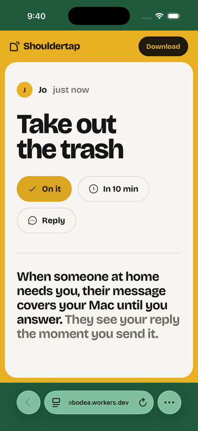
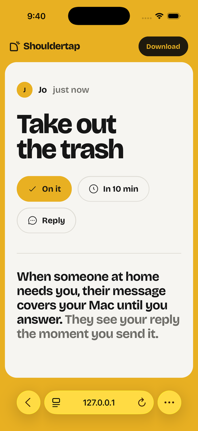

# Native Safari tint verification

Tested with Safari in the iPhone 17 Pro simulator running iOS 26.3.1.

The initial PR updated the document backgrounds correctly, but native Safari
retained the initial moss tint for the fixed page shell. The native screenshot
checker failed with:

```text
top: (31, 90, 61), frame: (232, 176, 34), bottom: (31, 89, 60)
FAIL: stale native Safari tint at top, bottom
```

A minimal HTML reproduction without React, gradients, or animations also failed.
Replacing its fixed node failed. Changing only its positioning to absolute made
the native bars follow every scene. The landing shell now uses that positioning
and retains its inner scroll area and animated wipe.

| Earlier fixed shell | Absolute shell |
| --- | --- |
|  |  |

For the corrected full page, the native screenshots measured ochre as
`top: (232, 176, 34), frame: (232, 176, 34), bottom: (229, 174, 34)`.
The bottom area has Safari's slight blur adjustment. The capture loop samples
all four scenes and wraparound; it tolerates a single sample during the 700ms
wipe, and fails on persistent mismatch. See
[`check-safari-tint.py`](../../apps/web/e2e/check-safari-tint.py) and the
[test instructions](../../apps/web/e2e/README.md).

These screenshots verify native simulator Safari. An actual iPhone remains a
separate final confirmation for device-specific behavior and toolbar layouts.
